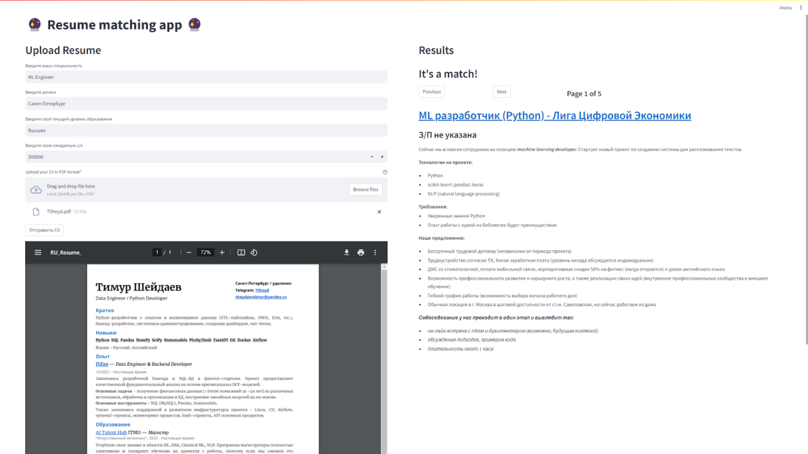

# AITH-resume-matching
AI Talent Hub Deep Learning Practice Course - NLP project on matching resumes with job descriptions.

# Задача
Подбор наиболее релевантных вакансий по резюме пользователя.

>Пользователь загружает резюме в формате PDF, опционально уточняет искомую позицию, свою геолокацию, зарплатные ожидания 
> и получает несколько самых релевантных предложений.

## Данные
- Открытый датасет ["Вакансии всех регионов России из ЕЦП «Работа в России»"](https://trudvsem.ru/opendata/datasets)

  Использовался для обучения Doc2Vec модели.

- [Датасет](https://t.me/danokhlopkov/704) вакансий с сайта HeadHunter by [danokhlopkov](https://t.me/danokhlopkov)

    Вакансии отсюда выводятся пользователю. В реальном решении такой задачи, конечно, 
датасет должен поддерживаться актуальным - обновляться свежими данными и чиститься от старых.

## Модели
В проекте применены две модели для последовательной выборки наиболее актуальных вакансий:
1. Фильтрация по специальности производится с помощью модели fastText методом поиска ближайших соседей в датасете
2. Из оставшихся предложений моделью Doc2Vec производится поиск наиболее схожих с текстом загруженного резюме описаний вакансий. 
   Эмбеддинги вакансий получены заранее и хранятся в индексе faiss.

## Эксперименты
В ходе разработки экспертной оценкой было установлено, что модель Doc2Vec лучше работает с б**о**льшим размером 
эмбеддингов (сравнивались vector_size=30 / 50 / 80, все версии моделей можно найти [здесь](https://disk.yandex.ru/d/lRbEmHhipI51MQ)), что обусловлено сравнительно большим размером текста в 
типичном резюме (1-2 листа А4).

## Производительность
Модель fastText вышла очень тяжелой как в плане размера, так и в плане скорости загрузки и работы приложения.
В случае проблем с производительностью можно воспользоваться версией приложения с одной лишь Doc2Vec моделью - `app_light.py`.

Обе версии сконфигурированы под запуск на CPU.

### Тесты 
Железо для тестов - Lenovo Thinkbook 14Gen3 ACL: 
- AMD Ryzen 7 5700U
- 24Gb RAM (под IDE отведено 8Gb)

Инференс всего датасета вакансий (96225 записей) с Doc2Vec занимает ~24минуты --> ~15мс на запись. 
Столько же в среднем занимает и инференс извлеченного текста резюме.
Запрос 5 ближайших соседей в faiss занимает в среднем до 20мс по результатам нескольких прогонов на разных эмбеддингах.

Запрос 150 ближайших соседей по эмбеддингам fastText занимает около 400мс, из чего можно сделать вывод о том, 
что б**о**льшая часть медлительности в приложении - из-за неоптимизированного формата модели и постоянной её реинициализации в streamlit.

По результатам тестов требования по RAM - от 1 Гб под `app_light.py` / от 8 Гб под `app.py`

## Приложение
В качестве интерфейса использовался Streamlit:

# Запуск
1. Клонирование репозитория: `git clone https://github.com/TSheyd/AITH-resume-matching.git`
2. Установка зависимостей: `pip install requirements.txt`. По версии Python - мы использовали 3.11.
3. Скачай последние версии модели и датасета по [ссылке](https://disk.yandex.ru/d/lRbEmHhipI51MQ), 
загрузи их в директории `model/` и `data/` соответственно.
  > Для **light**-версии приложения достаточно датасета **hh_light.csv**, скачивать hh_normal.csv и модель knn.joblib - не нужно.
4. Выполни в терминале `streamlit run app.py`. Первый запуск может быть довольно долгим из-за загрузки модели fastText.
  
   light-версия приложения запускается командой `streamlit run app_light.py`